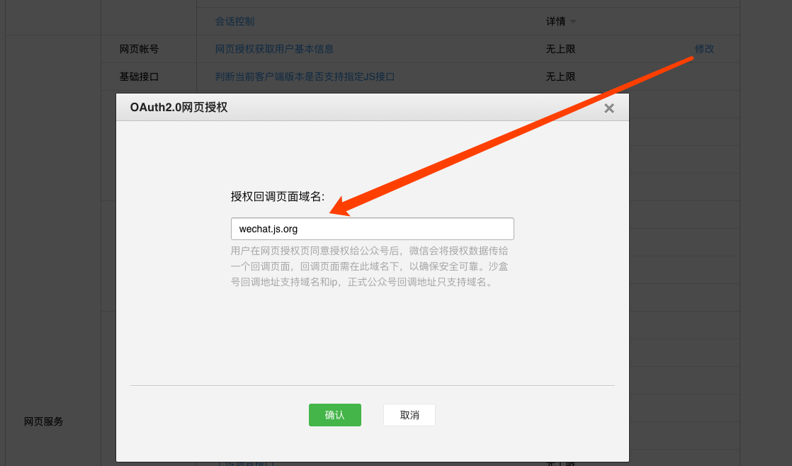

## wechat.pa-ca.me 使用文档

### 配置授权回调页面域名：

- 打开并登录 https://mp.weixin.qq.com/advanced/advanced?action=table&token=1857153716&lang=zh_CN
- 在 `接口权限`/`网页授权`/`网页授权获取用户基本信息` 一栏点击修改，并在弹出框中输入 `wechat.pa-ca.me`，然后"确认"保存。
